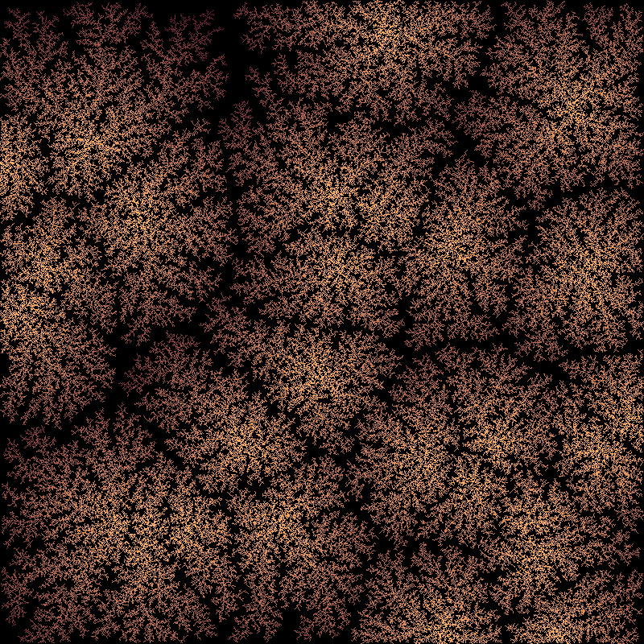
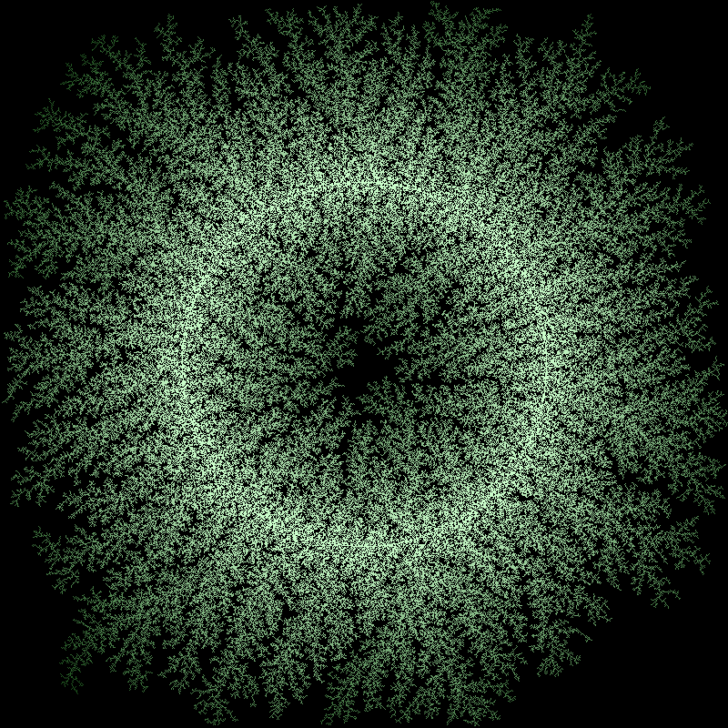
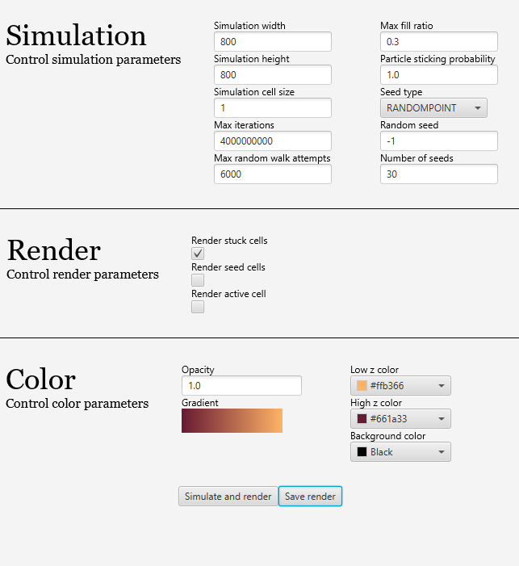

# Diffusion-Limited Aggregation (DLA) Simulation

A JavaFX application that simulates **Diffusion-Limited Aggregation (DLA)** using configurable parameters for simulation, rendering, and colors. Users can control simulation parameters rendering options in a graphical interface.

---

## Screenshots

---

